# Práctica 1 - Spring Boot

## 1. Verificación de Java

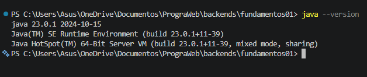

Se verificó la una versión compatible de Java mediante el comando `java -version`.

---

## 2. Ejecución del servidor Spring Boot

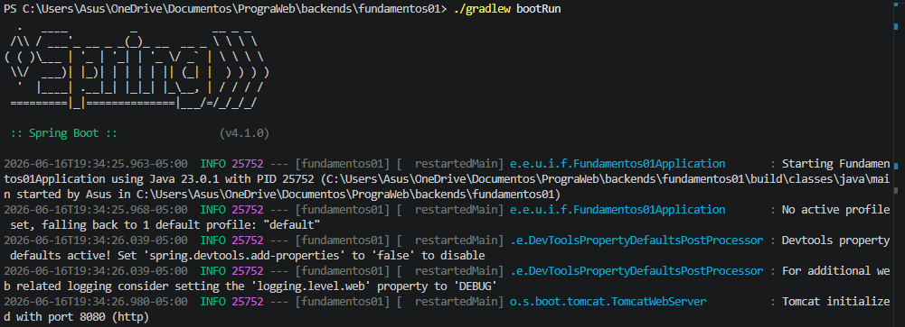

La aplicación inició correctamente utilizando `./gradlew bootRun` y Tomcat quedó escuchando en el puerto 8080.

---

## 3. Endpoint /api/status

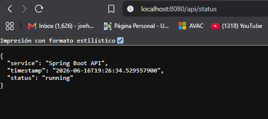

El endpoint responde correctamente en formato JSON mostrando el estado del servicio.

---

## 4. Verificación del controlador

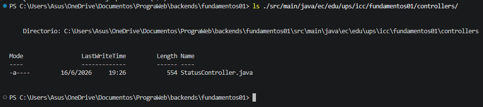

Se verificó la existencia del archivo `StatusController.java`.

---

## 5. Explicación

### Funcionamiento del endpoint

El endpoint `/api/status` permite comprobar que la API se encuentra en ejecución. Cuando recibe una petición GET devuelve un objeto JSON con información del servicio, estado y fecha actual.

### Función de Spring Boot

Spring Boot simplifica el desarrollo de aplicaciones backend mediante configuración automática, dependencias predefinidas y un servidor embebido Tomcat, permitiendo crear APIs REST de manera rápida y organizada.

## 6. Endopoint del controlador de estudiantes

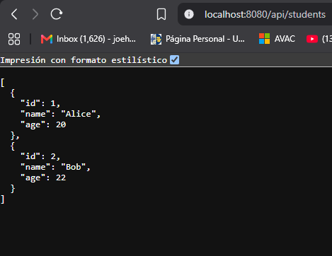

Se mostro el resultado del endoint.

## 7. Endpoint del controlador de estudiantes en la ruta de `count`

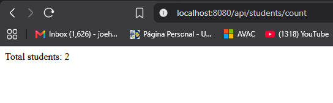

Se mostro el resultado del endoint.

## Práctica 5: Persistencia real con PostgreSQL, JPA y Repositorios

En esta práctica se reemplazó el almacenamiento temporal en memoria por una base de datos real PostgreSQL ejecutada mediante Docker.  
La aplicación Spring Boot se conecta a PostgreSQL usando la configuración definida en `application.yml`.

El flujo de datos inicia cuando el cliente realiza una petición HTTP al controlador REST.  
El controlador delega la operación al servicio, el servicio aplica la lógica de negocio y utiliza un repositorio JPA para comunicarse con PostgreSQL.  
El repositorio trabaja con entidades JPA, las cuales representan las tablas de la base de datos.

Para evitar exponer directamente la estructura de persistencia, se mantiene una separación entre DTOs, modelos y entidades.  
Los DTOs reciben y devuelven datos de la API, los modelos representan los datos dentro de la lógica de negocio y las entidades representan las tablas persistidas en PostgreSQL.

También se creó una superclase `BaseEntity`, la cual contiene campos comunes como `id`, `createdAt`, `updatedAt` y `deleted`.  
Esta clase permite reutilizar información de auditoría en diferentes entidades, como `UserEntity` y `ProductEntity`.

Finalmente, se implementó el módulo `products`, incluyendo entidad, repositorio, mapper, servicio, implementación del servicio y controlador.  
El CRUD completo de productos fue probado mediante API REST y los registros fueron verificados directamente en PostgreSQL con la consulta:

```sql
SELECT * FROM products;
```
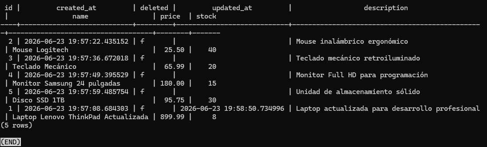


---

# Práctica 6: Validación de datos y manejo de errores

En esta práctica se implementó la validación de datos de entrada mediante anotaciones de Bean Validation en los DTOs, además del manejo de errores mediante excepciones personalizadas.

Se agregaron validaciones como:

- `@NotBlank` para campos obligatorios.
- `@NotNull` para valores requeridos.
- `@Size` para limitar longitud de cadenas.
- `@Min` para validar valores mínimos.
- `@DecimalMin` para validar valores numéricos.

Cuando una petición contiene datos inválidos, Spring Boot intercepta la excepción `MethodArgumentNotValidException` y devuelve una respuesta estructurada mediante `GlobalExceptionHandler`.

---

## 1. Respuesta de error por datos inválidos

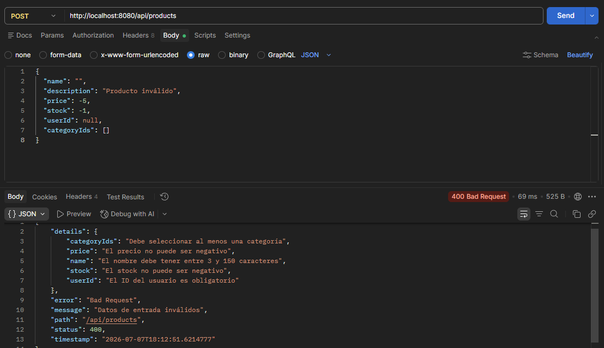

Se probó el envío de un producto con información incorrecta.

La API respondió con un error HTTP 400 Bad Request indicando los campos que incumplen las reglas de validación.

---

## 2. CRUD de productos con validaciones

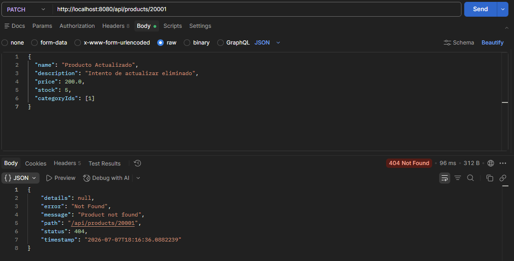

Se verificó el comportamiento del CRUD de productos aplicando reglas de negocio:

- No permite crear productos con precio negativo.
- No permite actualizar productos eliminados.
- El método `findAll()` únicamente devuelve productos activos.

Los productos eliminados utilizan eliminación lógica mediante el campo:

```java
deleted = true
```

por lo que permanecen almacenados en la base de datos, pero dejan de estar disponibles para las consultas normales.

---

# Práctica 7: Excepciones de dominio y manejo global de errores

En esta práctica se reemplazaron las excepciones genéricas como `IllegalStateException` por excepciones específicas del dominio:

- `NotFoundException`
- `ConflictException`
- `BadRequestException`

Estas excepciones son manejadas centralizadamente mediante `GlobalExceptionHandler`, permitiendo devolver respuestas HTTP uniformes.

---

## 1. Producto inexistente

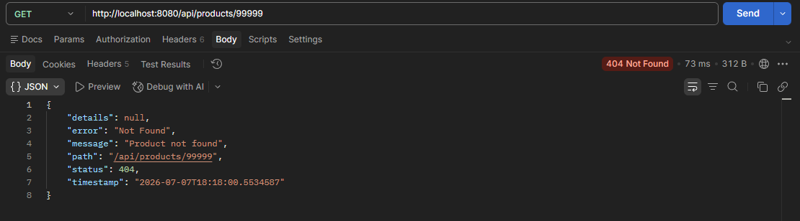

Se realizó la petición:

```http
GET /api/products/99999
```

La API respondió:

```json
{
    "status": 404,
    "error": "Not Found",
    "message": "Product not found"
}
```

Esto ocurre cuando el producto no existe o se encuentra eliminado lógicamente.

---

## 2. Producto duplicado

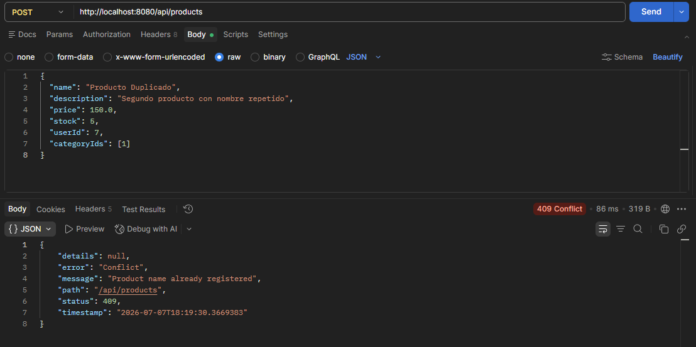

Se intentó crear un producto utilizando un nombre ya registrado:

```http
POST /api/products
```

La API respondió:

```json
{
    "status": 409,
    "error": "Conflict",
    "message": "Product name already registered"
}
```

La validación se realiza dentro del servicio antes de guardar el producto en PostgreSQL.

---

## 3. Error de validación DTO

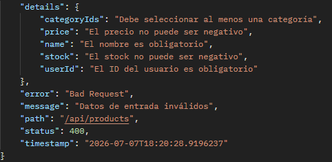

Se envió información inválida:

```json
{
  "name": "",
  "price": -5,
  "stock": -1
}
```

---

# Práctica 8: Relaciones entre entidades JPA

En esta práctica se implementaron relaciones entre entidades utilizando JPA e Hibernate.

El modelo de productos fue ampliado para relacionar cada producto con:

- Un usuario propietario.
- Una categoría asociada.

Estas relaciones permiten devolver información relacionada dentro de la respuesta REST.

---

## 1. Estructura de la tabla products

Se verificó la estructura de la tabla `products` en PostgreSQL, donde se almacenan los datos del producto y las referencias hacia las entidades relacionadas.

---

## 2. Creación de producto con relaciones

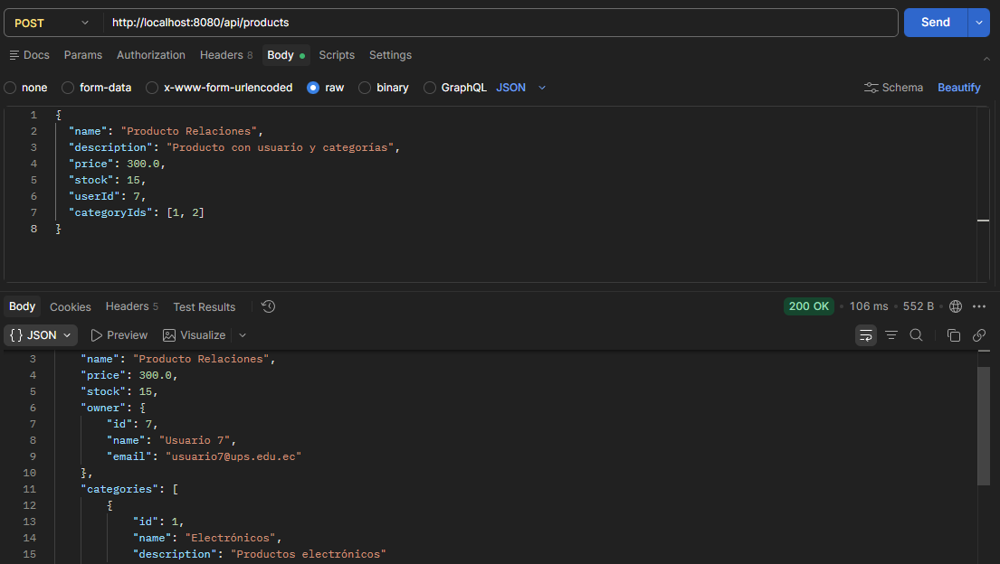

Se creó un producto mediante API REST:

```json
{
    "name": "Laptop Gaming",
    "price":1200.0,
    "stock":5,
    "userId":1,
    "categoryId":1
}
```

La respuesta incluye información relacionada:

```json
{
    "id":1,
    "name":"Laptop Gaming",
    "owner":{
        "id":1,
        "name":"Usuario"
    },
    "category":{
        "id":1,
        "name":"Tecnología"
    },
    "createdAt":"2026-07-01T10:40:17"
}
```

Se evidencia:

- Objeto anidado `owner`.
- Objeto anidado `category`.
- Campos de auditoría como `createdAt` y `updatedAt`.

---

## 3. Consulta de productos por categoría

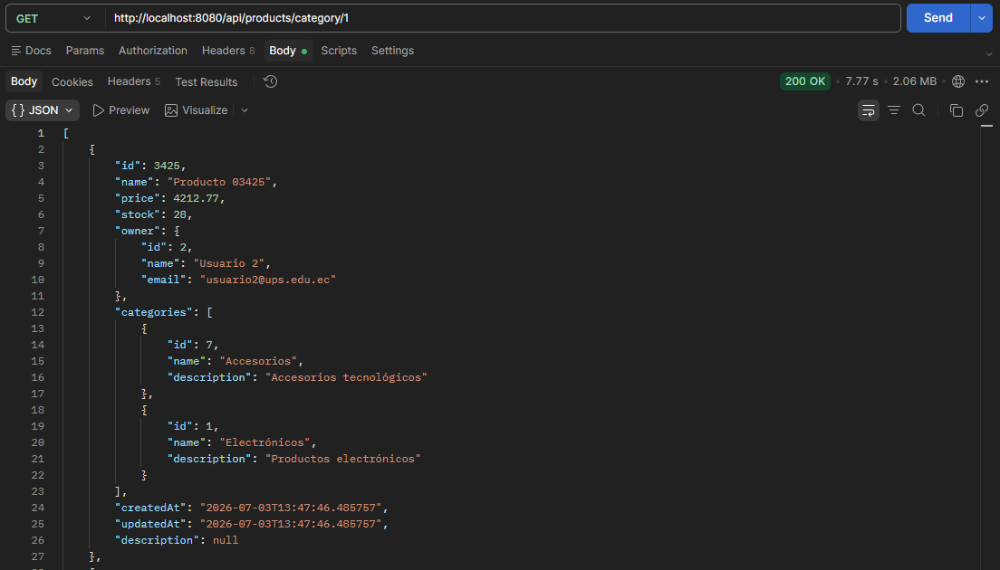

Consulta realizada:

```http
GET /api/products/category/1
```

La API devuelve únicamente los productos relacionados con la categoría indicada.

---

## Explicación de relaciones

La relación entre `ProductEntity` y `UserEntity` se implementa mediante:

```java
@ManyToOne
@JoinColumn(name="user_id")
private UserEntity owner;
```

Esto indica que:

- Un usuario puede tener varios productos.
- Cada producto pertenece a un único usuario.

La relación con categoría utiliza:

```java
@ManyToOne
@JoinColumn(name="category_id")
private CategoryEntity category;
```

Esto permite asociar cada producto con una categoría específica.

---

# Práctica 9: Consultas avanzadas y relaciones ManyToMany

En esta práctica se modificó la relación entre productos y categorías.

Anteriormente se tenía:

```
Product N -------- 1 Category
```

donde un producto pertenecía únicamente a una categoría.

La nueva implementación utiliza:

```
Product N -------- N Category
```

permitiendo que:

- Un producto tenga varias categorías.
- Una categoría tenga varios productos.

Para implementar esta relación se utilizó:

```java
@ManyToMany
@JoinTable(
    name="product_categories"
)
private Set<CategoryEntity> categories;
```

Hibernate genera una tabla intermedia:

```
product_categories
```

que almacena las relaciones entre ambas entidades.

---

## 1. Producto con varias categorías

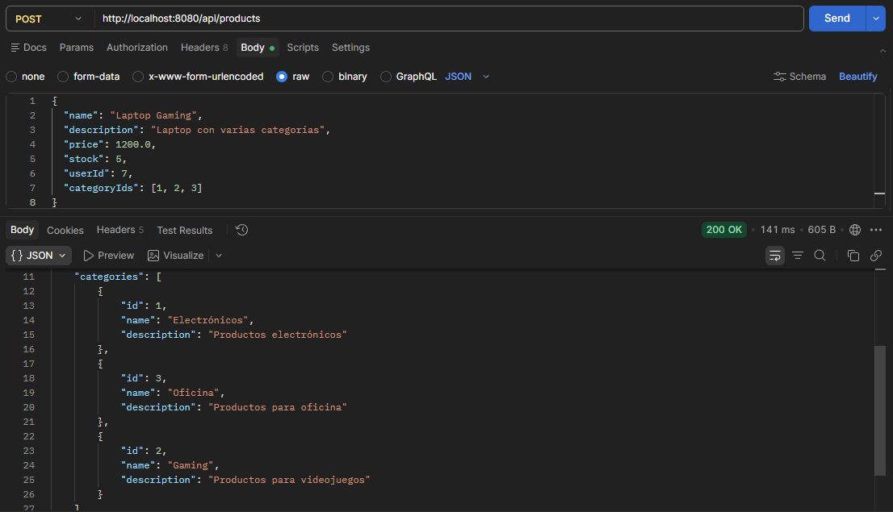

Se creó un producto enviando varias categorías:

```json
{
  "name": "Laptop Gaming",
  "price":1200.0,
  "stock":5,
  "userId":1,
  "categoryIds":[1,2,3]
}
```

La respuesta muestra las categorías asociadas al producto.

---

## 2. Consulta de productos filtrados por usuario

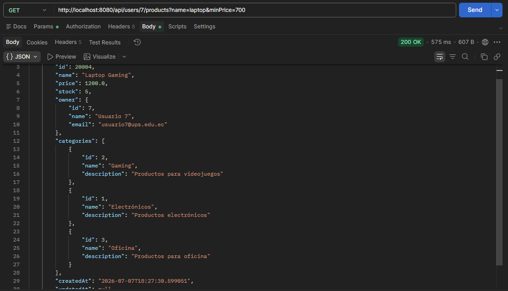

Consulta realizada:

```http
GET /api/users/1/products?name=laptop&minPrice=700
```

El endpoint permite obtener productos pertenecientes a un usuario aplicando filtros opcionales:

- Nombre.
- Precio mínimo.
- Precio máximo.
- Categoría.

---

## 3. Consulta de productos filtrados por categoría

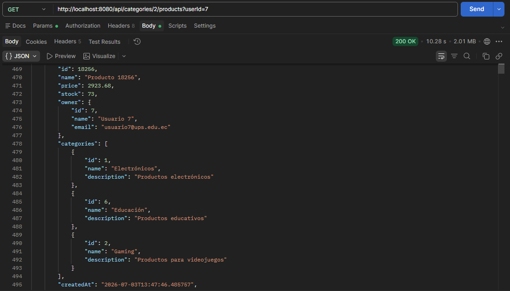

Consulta realizada:

```http
GET /api/categories/2/products?userId=7
```

Permite consultar productos asociados a una categoría aplicando filtros adicionales.

---

## Explicación de arquitectura

Aunque los endpoints se encuentran dentro del contexto:

```
/users/{id}/products
/categories/{id}/products
```

la lógica de consulta permanece en:

```
ProductService
        |
        |
ProductRepository
```

Esto mantiene la responsabilidad correctamente separada:

- El controlador únicamente recibe peticiones HTTP.
- El servicio contiene la lógica de negocio.
- El repositorio realiza consultas a PostgreSQL.

De esta manera, aunque la ruta pertenezca al contexto de usuarios o categorías, los datos consultados pertenecen al dominio de productos.

---

## Cambio de relación Product - Category

Antes:

```
Product N -------- 1 Category
```

Cada producto solo podía tener una categoría.

Después:

```
Product N -------- N Category
```

Un producto puede pertenecer a varias categorías y una categoría puede contener varios productos.

Esto requiere una tabla intermedia:

```
product_categories
```

que almacena las asociaciones entre productos y categorías.


---

# Práctica 10: Paginación de Productos con Page, Slice y Pageable

En esta práctica se implementó paginación en el módulo de productos utilizando Spring Data JPA.

El objetivo fue evitar que el backend devuelva todos los registros en una sola respuesta cuando existen muchos productos almacenados en la base de datos.

Se trabajó con:

- `Page`
- `Slice`
- `Pageable`
- `PageRequest`
- `Sort`
- validación de parámetros de paginación
- endpoints paginados para productos
- endpoints paginados para productos por categoría

## Endpoints implementados

| Método | Endpoint | Descripción |
|--------|----------|-------------|
| GET | `/api/products` | Lista todos los productos activos |
| GET | `/api/products/page` | Lista productos usando `Page` |
| GET | `/api/products/slice` | Lista productos usando `Slice` |
| GET | `/api/categories/{id}/products/page` | Lista productos por categoría usando `Page` |
| GET | `/api/categories/{id}/products/slice` | Lista productos por categoría usando `Slice` |

---

## Consulta sin paginación


El endpoint:

```http
GET /api/products
```

devuelve todos los productos activos en una sola respuesta.

Aunque el endpoint funciona correctamente, este enfoque no es recomendable cuando existen muchos registros, porque puede generar:

- respuestas demasiado grandes
- mayor consumo de memoria
- más tráfico de red
- mayor tiempo de respuesta
- carga innecesaria para el cliente

Por esta razón se implementó paginación.

---

## Consulta con Page


El endpoint:

```http
GET /api/products/page?page=0&size=5
```

devuelve una respuesta paginada con metadatos completos.

La respuesta con `Page` incluye información como:

```txt
content
totalElements
totalPages
number
size
first
last
```

Ejemplo de endpoint con ordenamiento:

```http
GET /api/products/page?page=0&size=5&sortBy=price&direction=desc
```

`Page` es útil cuando el frontend necesita mostrar información como:

```txt
Página actual
Total de registros
Total de páginas
Primera página
Última página
```

---

## Consulta con Slice


El endpoint:

```http
GET /api/products/slice?page=0&size=5
```

devuelve una respuesta paginada más ligera.

A diferencia de `Page`, `Slice` no devuelve:

```txt
totalElements
totalPages
```

`Slice` es útil cuando solo se necesita saber si existe una página siguiente o anterior, por ejemplo en scroll infinito o navegación simple.

---

## Error por paginación inválida


Se probó el endpoint:

```http
GET /api/products/page?page=-1&size=0
```

La API respondió:

```http
400 Bad Request
```

Esto ocurre porque `PaginationDto` valida los parámetros recibidos desde query params.

Validaciones aplicadas:

```java
@Min(value = 0)
private int page;

@Min(value = 1)
@Max(value = 100)
private int size;
```

---

## Productos por categoría con Page


Se implementó paginación para productos relacionados con una categoría.

Endpoint probado:

```http
GET /api/categories/2/products/page?page=0&size=5
```

Este endpoint devuelve productos activos asociados a una categoría específica, aplicando paginación con `Page`.

---

## Productos por categoría con Slice


También se implementó la versión con `Slice`.

Endpoint probado:

```http
GET /api/categories/2/products/slice?page=0&size=5
```

Esta versión es más liviana porque no ejecuta una consulta `COUNT`.

---

## Diferencia entre Page y Slice

| Aspecto | Page | Slice |
|--------|------|-------|
| Devuelve contenido | Sí | Sí |
| Devuelve total de registros | Sí | No |
| Devuelve total de páginas | Sí | No |
| Ejecuta consulta COUNT | Sí | No |
| Es más completo | Sí | No |
| Es más liviano | No | Sí |
| Uso recomendado | Tablas administrativas | Scroll infinito o navegación simple |

---

## ¿Por qué la paginación debe aplicarse en el repositorio?

La paginación debe aplicarse directamente en el repositorio porque Spring Data JPA traduce `Pageable` a consultas SQL con:

```sql
LIMIT
OFFSET
ORDER BY
```

Esto permite traer desde PostgreSQL únicamente los registros necesarios.

No es recomendable traer todos los datos y luego paginar en memoria, porque eso provocaría:

- mayor consumo de RAM
- consultas más lentas
- respuestas innecesariamente grandes
- peor rendimiento del backend
- sobrecarga del cliente

---

# Práctica 11: Autenticación JWT, Roles y Protección de Endpoints

En esta práctica se implementó autenticación con JWT utilizando Spring Security.

El objetivo fue proteger los endpoints de la API para que solo usuarios autenticados puedan acceder a los recursos privados.

Se implementó:

- registro de usuarios
- login de usuarios
- generación de token JWT
- validación de token JWT
- roles con `ROLE_USER` y `ROLE_ADMIN`
- cifrado de contraseñas con BCrypt
- protección global de endpoints
- endpoints públicos para autenticación

---

## Endpoints públicos

| Método | Endpoint | Descripción |
|--------|----------|-------------|
| POST | `/api/auth/register` | Registro de usuario |
| POST | `/api/auth/login` | Inicio de sesión |

Estos endpoints no requieren token.

---

## Registro de usuario


Se probó el endpoint:

```http
POST /api/auth/register
```

Body utilizado:

```json
{
  "name": "Usuario A",
  "email": "usera@ups.edu.ec",
  "password": "Password123"
}
```

La respuesta fue:

```http
201 Created
```

El backend creó el usuario, cifró la contraseña con BCrypt, asignó el rol `ROLE_USER` por defecto y devolvió un token JWT.

---

## Login de usuario


Se probó el endpoint:

```http
POST /api/auth/login
```

Body utilizado:

```json
{
  "email": "usera@ups.edu.ec",
  "password": "Password123"
}
```

La respuesta fue:

```http
200 OK
```

El backend validó las credenciales y devolvió un token JWT.

---

## Estructura de respuesta de autenticación

La respuesta de login y register contiene:

```json
{
  "token": "eyJhbGciOiJIUzI1NiJ9...",
  "type": "Bearer",
  "userId": 14,
  "name": "Usuario A",
  "email": "usera@ups.edu.ec",
  "roles": [
    "ROLE_USER"
  ]
}
```

El token debe enviarse en las peticiones protegidas mediante el header:

```http
Authorization: Bearer TOKEN
```

---

## Endpoint protegido sin token


Se intentó acceder a un endpoint protegido sin enviar token:

```http
GET /api/products/page?page=0&size=5
```

La API respondió:

```http
401 Unauthorized
```

Esto demuestra que los endpoints privados requieren autenticación.

---

## Endpoint protegido con token


Se volvió a consumir el mismo endpoint, pero esta vez enviando el token JWT:

```http
GET /api/products/page?page=0&size=5
Authorization: Bearer TOKEN
```

La API respondió:

```http
200 OK
```

Esto confirma que el token fue validado correctamente por el filtro JWT.

---

## Roles en base de datos


Se verificó que existan los roles base del sistema:

```sql
SELECT id, name, description
FROM roles;
```

Roles esperados:

```txt
ROLE_USER
ROLE_ADMIN
```

Estos roles se crean automáticamente al iniciar la aplicación mediante `SecurityDataInitializer`.

---

## Explicación

JWT permite implementar autenticación sin sesiones en el servidor.

El flujo aplicado fue:

```txt
Usuario inicia sesión
  ↓
Backend valida email y contraseña
  ↓
Backend genera JWT
  ↓
Cliente guarda el token
  ↓
Cliente envía el token en cada petición protegida
  ↓
JwtAuthenticationFilter valida el token
  ↓
Spring Security permite o rechaza el acceso
```

---

# Práctica 12: Protección de Endpoints con Roles

En esta práctica se implementó autorización por roles usando Spring Security y `@PreAuthorize`.

La autenticación ya estaba implementada mediante JWT en la práctica anterior. En esta práctica se agregó una segunda capa de seguridad para controlar qué usuarios pueden acceder a ciertos endpoints según su rol.

---

## Endpoints protegidos por rol

| Endpoint | Protección | Acceso |
|----------|------------|--------|
| `GET /api/products` | `@PreAuthorize("hasRole('ADMIN')")` | Solo ADMIN |
| `GET /api/products/page` | Usuario autenticado | USER y ADMIN |
| `GET /api/products/slice` | Usuario autenticado | USER y ADMIN |
| `POST /api/products` | Usuario autenticado | USER y ADMIN |
| `PUT /api/products/{id}` | Usuario autenticado + ownership | Owner o ADMIN |
| `DELETE /api/products/{id}` | Usuario autenticado + ownership | Owner o ADMIN |

---

## Usuario sin rol ADMIN


Se probó el endpoint:

```http
GET /api/products
```

usando un usuario con `ROLE_USER`.

La respuesta fue:

```http
403 Forbidden
```

Esto ocurre porque el método está protegido con:

```java
@PreAuthorize("hasRole('ADMIN')")
```

Un usuario autenticado pero sin el rol correcto no recibe `401`, sino `403`, porque sí está autenticado, pero no autorizado.

---

## Usuario ADMIN


Se probó el mismo endpoint con un usuario que tiene `ROLE_ADMIN`.

La respuesta fue:

```http
200 OK
```

El usuario administrador pudo consultar el listado completo de productos.

---

## Endpoint paginado permitido para USER


Se probó:

```http
GET /api/products/page?page=0&size=5
```

con un usuario `ROLE_USER`.

La respuesta fue:

```http
200 OK
```

Este endpoint no tiene `@PreAuthorize("hasRole('ADMIN')")`, por lo que solo requiere un token válido.

---

## Acceso sin token


Cuando se intenta consumir un endpoint protegido sin token JWT, la API responde:

```http
401 Unauthorized
```

Esto demuestra que la autenticación JWT sigue activa.

---

## Usuarios y roles en PostgreSQL


Se verificó en PostgreSQL que los usuarios tienen roles asignados mediante la tabla intermedia `user_roles`.

Consulta utilizada:

```sql
SELECT 
    u.id AS user_id,
    u.name AS user_name,
    u.email,
    r.name AS role_name
FROM users u
JOIN user_roles ur ON ur.user_id = u.id
JOIN roles r ON r.id = ur.role_id
ORDER BY u.id;
```

---

## Explicación

`@PreAuthorize` permite proteger métodos específicos antes de que se ejecuten.

Ejemplo:

```java
@PreAuthorize("hasRole('ADMIN')")
```

Esto significa que el método solo podrá ejecutarse si el usuario autenticado tiene la autoridad:

```txt
ROLE_ADMIN
```

La diferencia entre autenticación y autorización es:

- Autenticación: verifica quién es el usuario mediante JWT.
- Autorización: verifica qué permisos tiene el usuario mediante roles.

Si el usuario no envía token, la API responde:

```http
401 Unauthorized
```

Si el usuario tiene token válido pero no tiene el rol requerido, la API responde:

```http
403 Forbidden
```

---

# Práctica 13: Validación de Ownership

En esta práctica se implementó validación de propiedad de recursos en el módulo de productos.

El objetivo fue evitar que un usuario autenticado pueda modificar o eliminar productos pertenecientes a otro usuario.

La práctica responde la pregunta:

```txt
¿Este recurso te pertenece?
```

---

## Reglas aplicadas

| Acción | ROLE_USER | ROLE_ADMIN |
|--------|-----------|------------|
| Crear producto | Sí | Sí |
| Editar producto propio | Sí | Sí |
| Editar producto ajeno | No | Sí |
| Eliminar producto propio | Sí | Sí |
| Eliminar producto ajeno | No | Sí |
| Consultar productos paginados | Sí | Sí |
| Consultar todos los productos | No | Sí |

---

## Creación de producto con usuario autenticado


Se creó un producto mediante:

```http
POST /api/products
```

Body utilizado:

```json
{
  "name": "Laptop Usuario A",
  "description": "Producto perteneciente al Usuario A",
  "price": 900.0,
  "stock": 10,
  "categoryIds": [1, 2]
}
```

Desde esta práctica ya no se envía `userId` en el body.

El propietario se obtiene directamente desde el token JWT mediante:

```java
@AuthenticationPrincipal UserDetailsImpl currentUser
```

La respuesta evidencia que el objeto `owner` corresponde al usuario dueño del token utilizado.

---

## Actualización de producto propio


El usuario propietario del producto pudo actualizarlo correctamente usando:

```http
PUT /api/products/{id}
```

La API respondió:

```http
200 OK
```

Esto ocurre porque el usuario autenticado coincide con el `owner` del producto.

---

## Bloqueo de actualización de producto ajeno


Se utilizó el token de otro usuario para intentar modificar un producto que no le pertenece.

Endpoint probado:

```http
PUT /api/products/{id}
```

La API respondió:

```http
403 Forbidden
```

Mensaje esperado:

```txt
No puedes modificar productos ajenos
```

Esto demuestra que la validación de ownership funciona correctamente.

---

## Bloqueo de eliminación de producto ajeno


Un usuario distinto al propietario intentó eliminar el producto mediante:

```http
DELETE /api/products/{id}
```

La API respondió:

```http
403 Forbidden
```

Esto evita que un usuario elimine productos de otro usuario.

---

## ADMIN modificando producto ajeno


Un usuario con `ROLE_ADMIN` pudo modificar correctamente un producto perteneciente a otro usuario.

La respuesta fue:

```http
200 OK
```

Esto ocurre porque `ROLE_ADMIN` puede saltarse la restricción de ownership.

---

## ADMIN eliminando producto ajeno


Se probó la eliminación de un producto ajeno usando un usuario con `ROLE_ADMIN`.

Endpoint:

```http
DELETE /api/products/{id}
```

Resultado:

```http
204 No Content
```

---

## Productos y propietarios en PostgreSQL


Se verificó directamente en PostgreSQL la relación entre productos y propietarios.

Consulta utilizada:

```sql
SELECT
    p.id AS product_id,
    p.name AS product_name,
    p.user_id AS owner_id,
    u.name AS owner_name,
    u.email AS owner_email,
    p.deleted
FROM products p
INNER JOIN users u ON u.id = p.user_id
ORDER BY p.id;
```

---

## Implementación de Slice solo para el dueño


Según la regla indicada, el endpoint:

```http
GET /api/products/slice?page=0&size=5
```

puede ser consumido por cualquier usuario autenticado, pero solo devuelve los productos del usuario dueño del token.

Regla aplicada:

| Método | Rol | Productos |
|--------|-----|-----------|
| `findAll` | ADMIN | Todos |
| `page` | Todos los autenticados | Todos |
| `slice` | Todos los autenticados | Solo del dueño |

Esto se implementó obteniendo el usuario autenticado con:

```java
@AuthenticationPrincipal UserDetailsImpl currentUser
```

y filtrando por:

```java
p.owner.id = currentUser.getId()
```

---

## ¿Qué es ownership?

Ownership significa propiedad de un recurso.

En esta API, cada producto pertenece a un usuario específico mediante la relación:

```txt
ProductEntity → owner → UserEntity
```

La validación de ownership comprueba que el usuario autenticado sea el propietario del producto antes de permitir operaciones de actualización o eliminación.

---

## ¿Por qué no es seguro recibir userId en CreateProductDto?

No es seguro porque el cliente podría enviar el ID de otro usuario y crear productos a nombre de una persona diferente.

Ejemplo inseguro:

```json
{
  "name": "Laptop",
  "price": 900,
  "stock": 10,
  "userId": 5,
  "categoryIds": [1, 2]
}
```

Por esa razón, el propietario se obtiene directamente desde el token JWT del usuario autenticado y no desde el body de la petición.

---

## Diferencia entre autorización por rol y autorización por ownership

La autorización por rol comprueba permisos generales del usuario.

Ejemplo:

```java
@PreAuthorize("hasRole('ADMIN')")
```

Esto permite restringir un endpoint completo solo a administradores.

La autorización por ownership comprueba si un recurso específico pertenece al usuario autenticado.

Ejemplo:

```txt
Usuario A puede modificar sus productos.
Usuario B no puede modificar productos de Usuario A.
ADMIN puede modificar cualquier producto.
```

---

# Práctica 14: Preparación y Despliegue de API con Spring Boot

En esta práctica se preparó la API de Spring Boot para un entorno más cercano a producción.  
Se trabajó con perfiles de configuración, generación del archivo `.jar`, Actuator y ejecución mediante Docker Compose.

El objetivo principal fue verificar que la aplicación pueda ejecutarse fuera del entorno normal de desarrollo y que exponga un endpoint de monitoreo para comprobar su estado.

---

## Configuración realizada

Se agregaron configuraciones separadas para distintos ambientes:

```txt
application.yml
application-dev.yml
application-prod.yml
```

El archivo `application.yml` mantiene la configuración base del proyecto, mientras que `application-dev.yml` se usa para desarrollo local y `application-prod.yml` para ejecución en un entorno productivo o con Docker.

También se agregó Spring Boot Actuator para exponer endpoints de monitoreo como:

```http
GET /api/actuator/health
```

Este endpoint permite verificar si la aplicación se encuentra funcionando correctamente.

---

## Generación y ejecución del JAR

Se configuró el proyecto para generar un archivo ejecutable:

```txt
fundamentos01-api.jar
```

El JAR permite ejecutar la aplicación sin depender directamente del comando `bootRun`.

Comando usado:

```cmd
java -jar build\libs\fundamentos01-api.jar --spring.profiles.active=dev
```

Con esto la aplicación se ejecutó usando el perfil de desarrollo.

---

## Verificación del estado de la API

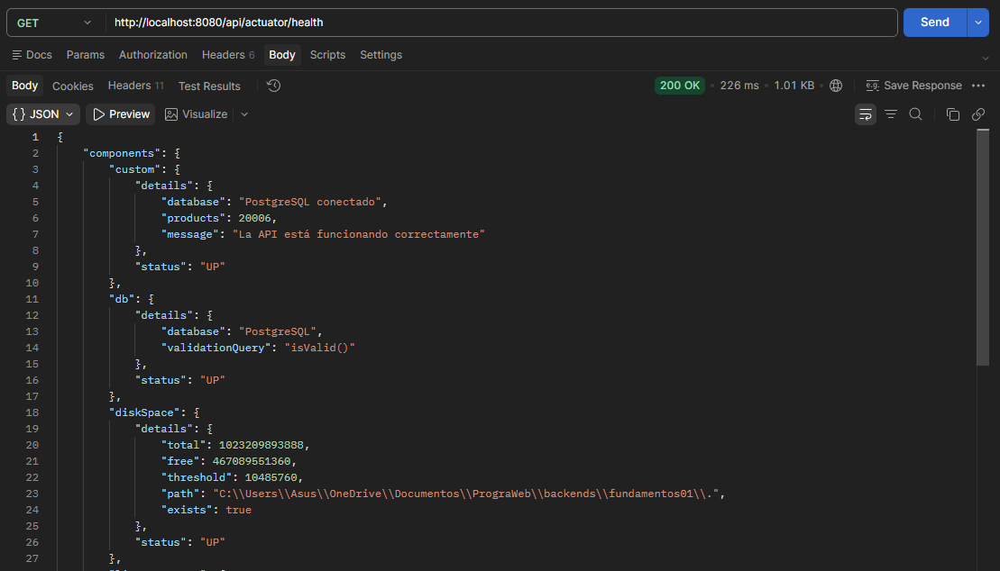

Se probó el endpoint de Actuator:

```http
GET http://localhost:8080/api/actuator/health
```

La respuesta obtenida fue:

```json
{
  "status": "UP"
}
```

Esto indica que la API está levantada correctamente y que el endpoint de monitoreo funciona.

---

## Ejecución con Docker Compose

También se preparó la ejecución del proyecto usando Docker Compose.  
Para esto se creó un archivo:

```txt
docker-compose.yml
```

El objetivo fue levantar los servicios necesarios desde Docker, incluyendo la API y PostgreSQL.

Comando usado:

```cmd
docker compose up -d --build
```

Después se verificó el estado de los contenedores con:

```cmd
docker compose ps
```

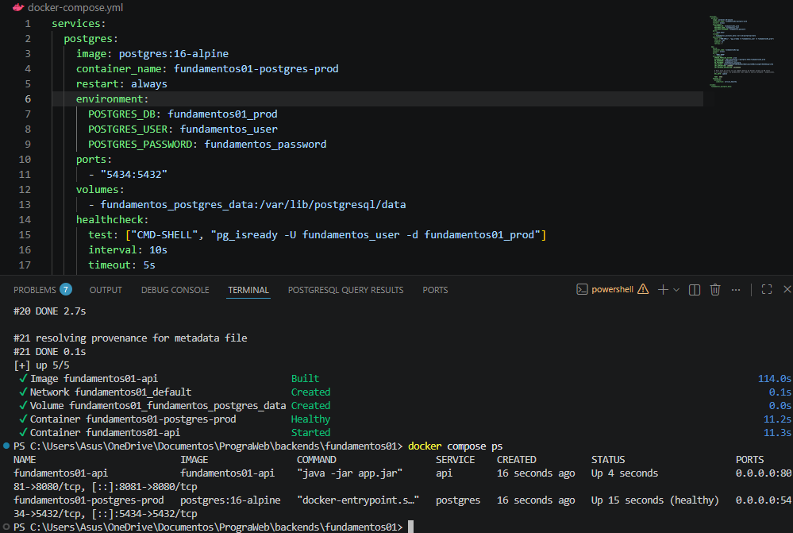

Esta captura evidencia el estado de los servicios gestionados por Docker Compose.

---

## Archivos principales agregados o modificados

| Archivo | Descripción |
|--------|-------------|
| `application.yml` | Configuración base del proyecto |
| `application-dev.yml` | Configuración para desarrollo local |
| `application-prod.yml` | Configuración para producción |
| `build.gradle` | Configuración para generar el JAR y agregar Actuator |
| `Dockerfile` | Archivo para construir la imagen de la API |
| `docker-compose.yml` | Archivo para levantar API y base de datos con Docker |
| `.dockerignore` | Archivo para excluir archivos innecesarios del build Docker |

# Práctica 15: Documentación de API con Swagger y OpenAPI

## Resultados y evidencias

### Swagger UI cargado

Ruta utilizada:

```txt
/api/swagger-ui/index.html
```

La interfaz de Swagger mostró la lista de controladores y los endpoints agrupados por tags.

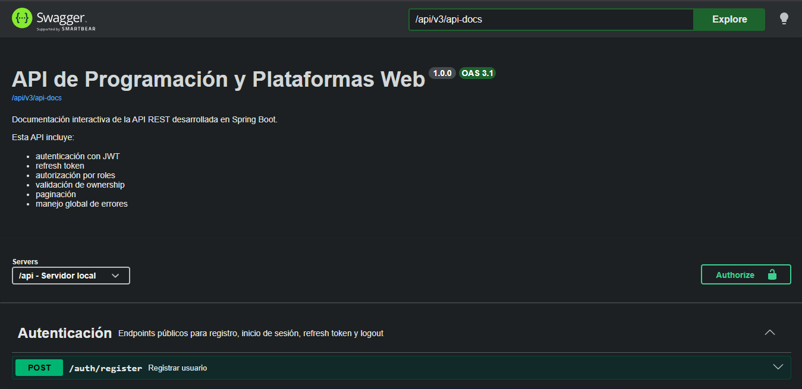

---

### JSON OpenAPI

Ruta utilizada:

```txt
/api/v3/api-docs
```

La respuesta permitió evidenciar las secciones principales de la especificación:

```txt
openapi
paths
components
```

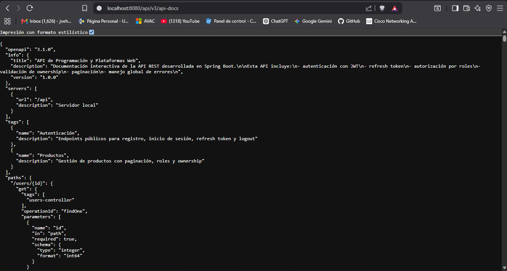

---

### AuthController documentado

En Swagger se visualizaron los endpoints:

```txt
POST /api/auth/register
POST /api/auth/login
```

También se mostraron las descripciones, cuerpos de petición y posibles respuestas HTTP.

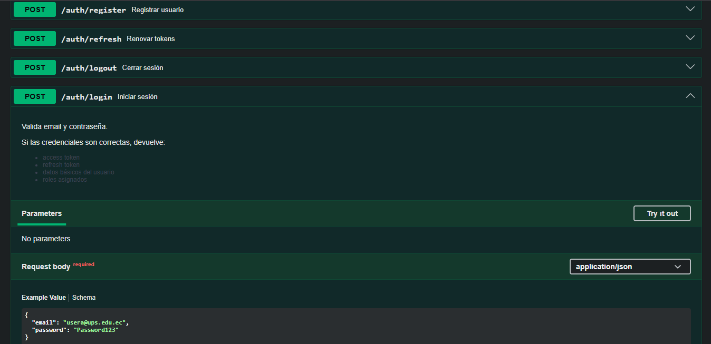

---

### Botón Authorize

Swagger mostró el botón `Authorize` con el esquema de seguridad:

```txt
bearerAuth
JWT
```

Este botón permite ingresar un access token para consumir endpoints protegidos.

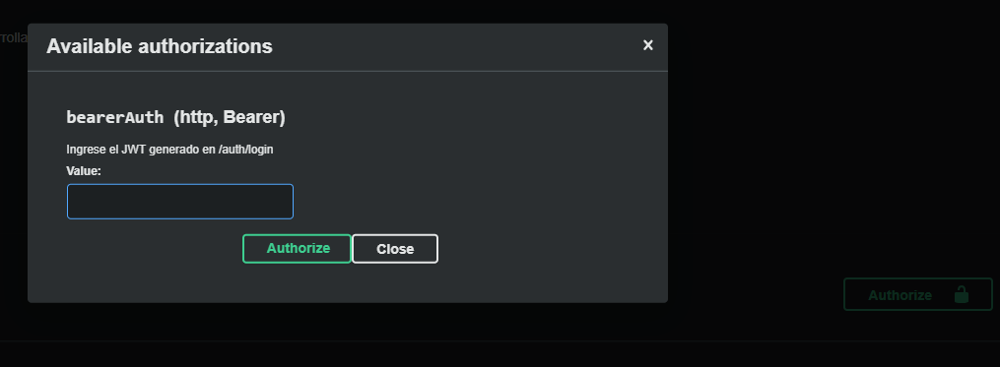

---

### Endpoint protegido sin token

Endpoint probado:

```txt
GET /api/products/page?page=0&size=5
```

Al ejecutar el endpoint sin configurar un token JWT, la respuesta fue:

```txt
401 Unauthorized
```

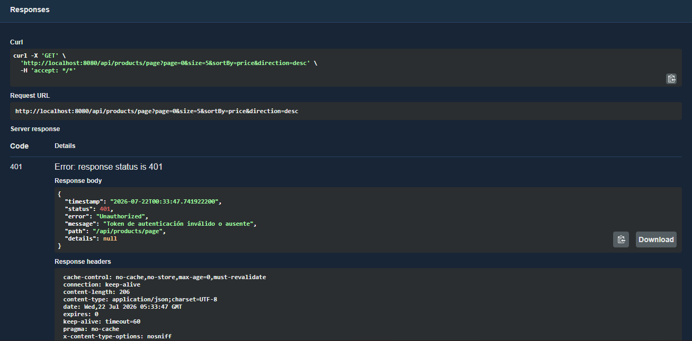

---

### Endpoint protegido con token

Endpoint probado:

```txt
GET /api/products/page?page=0&size=5
```

Después de configurar un access token válido mediante el botón `Authorize`, la respuesta fue:

```txt
200 OK
```

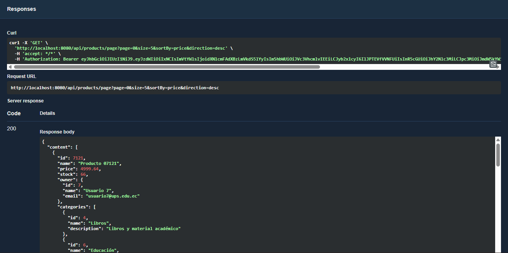

---

### Endpoint ADMIN con usuario normal

Endpoint probado:

```txt
GET /api/products
```

Se utilizó un token perteneciente a un usuario con:

```txt
ROLE_USER
```

La API respondió:

```txt
403 Forbidden
```

Esto demuestra que el usuario estaba autenticado, pero no tenía el rol requerido.

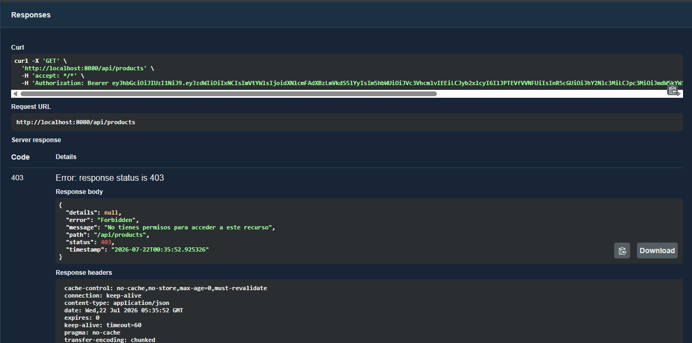

---

### Endpoint ADMIN con usuario administrador

Endpoint probado:

```txt
GET /api/products/{id}
```

Se utilizó un token perteneciente a un usuario con:

```txt
ROLE_ADMIN
```

La API respondió:

```txt
200 OK
```

Esto demuestra que el endpoint está correctamente protegido por roles.

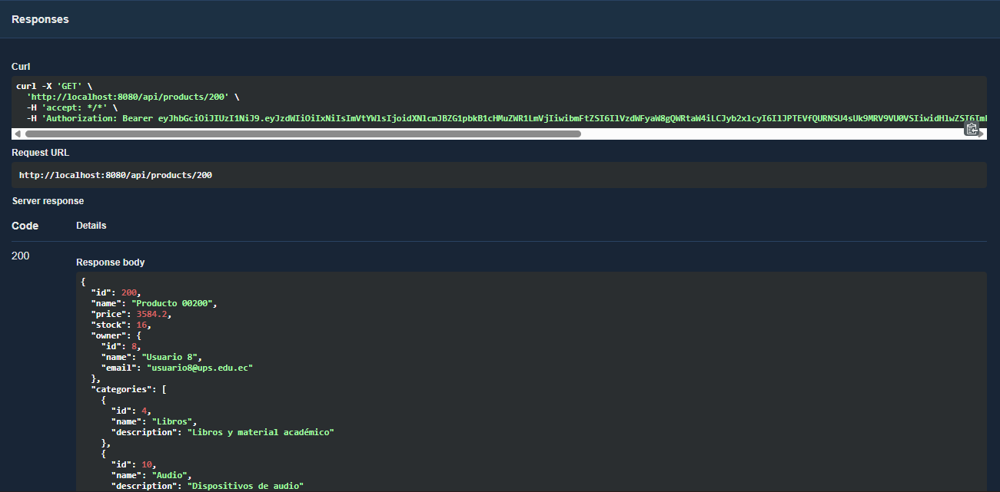

---

## Explicación breve

### ¿Cuál es la diferencia entre Swagger UI y OpenAPI?

OpenAPI es la especificación que describe la estructura de la API en formato JSON o YAML.

Contiene información sobre:

```txt
rutas
métodos HTTP
parámetros
cuerpos de petición
respuestas
schemas
seguridad
```

Swagger UI es la interfaz gráfica que interpreta esa especificación y permite visualizar y probar los endpoints desde el navegador.

En este proyecto:

```txt
/api/v3/api-docs
```

devuelve la especificación OpenAPI.

Mientras que:

```txt
/api/swagger-ui/index.html
```

muestra la interfaz Swagger UI.

---

### ¿Por qué Swagger puede ser público pero los endpoints seguir protegidos?

Swagger UI y el documento OpenAPI pueden configurarse como públicos para permitir que los desarrolladores consulten la documentación sin autenticarse.

Sin embargo, los endpoints reales siguen siendo procesados por Spring Security.

Por esta razón, Swagger puede abrirse sin token, pero al ejecutar un endpoint protegido la API puede responder:

```txt
401 Unauthorized
```

si el usuario no está autenticado.

También puede responder:

```txt
403 Forbidden
```

si el usuario está autenticado, pero no tiene el rol requerido.

---

### ¿Cómo se configura Swagger para enviar un JWT en Authorization: Bearer?

Se configura un esquema de seguridad Bearer JWT en OpenAPI:

```java
SecurityScheme bearerScheme = new SecurityScheme()
        .type(SecurityScheme.Type.HTTP)
        .scheme("bearer")
        .bearerFormat("JWT");
```

El esquema se registra con el nombre:

```txt
bearerAuth
```

Luego, los controladores protegidos utilizan:

```java
@SecurityRequirement(name = "bearerAuth")
```

Con esta configuración aparece el botón `Authorize` en Swagger UI.

Después de ingresar el token, Swagger envía automáticamente el encabezado:

```http
Authorization: Bearer TOKEN_JWT
```
---

# Práctica 16: Despliegue portable de Spring Boot con Docker y Nginx en Ubuntu Server

## Objetivo

El objetivo de esta práctica fue preparar y desplegar una API Spring Boot mediante Docker en un Ubuntu Server, utilizando variables de entorno para separar la configuración del código fuente.

La solución fue construida sin Docker Compose. Cada imagen, red y contenedor se administró mediante comandos Docker.

También se configuró Nginx como proxy inverso para que sea el único servicio publicado hacia la máquina anfitriona.

La arquitectura final implementada fue:

```text
Máquina anfitriona Windows
        │
        │ HTTP
        ▼
Ubuntu Server: 192.168.56.101
        │
        │ Puerto 80
        ▼
Nginx
        │
        │ Red Docker app-network
        ▼
Spring Boot: fundamentos-api:8080
        │
        │ jdbc:postgresql://postgres:5432/devdb
        ▼
PostgreSQL en Docker
```

---

## Configuración utilizada

La aplicación se ejecutó con el profile:

```text
prod
```

Las variables específicas del entorno se almacenaron en:

```text
.env.ubuntu
```

La configuración principal utilizada fue:

```dotenv
SPRING_PROFILES_ACTIVE=prod
PORT=8080

DATABASE_URL=jdbc:postgresql://postgres:5432/devdb
DB_USERNAME=ups
DB_PASSWORD=ups123

JPA_DDL_AUTO=update
JPA_SHOW_SQL=false

JWT_EXPIRATION=1800000
JWT_REFRESH_EXPIRATION=604800000
JWT_ISSUER=fundamentos01-api

DB_POOL_MAX_SIZE=10
DB_POOL_MIN_IDLE=2
DB_CONNECTION_TIMEOUT=20000

ROOT_LOG_LEVEL=WARN
APP_LOG_LEVEL=INFO
```

El archivo `.env.ubuntu` no fue incluido en la imagen Docker ni enviado al repositorio Git.

---

## Red Docker

Se creó una red privada llamada:

```text
app-network
```

Comando utilizado:

```bash
docker network create app-network
```

Los siguientes contenedores fueron conectados a esta red:

```text
nginx
fundamentos-api
postgres
```

Esto permite que los contenedores se comuniquen mediante sus nombres internos.

---

## Imágenes utilizadas

La imagen de la API fue construida mediante un Dockerfile multi-stage:

```text
fundamentos-api:1.0
```

También se utilizaron las imágenes:

```text
nginx:alpine
postgres:17-alpine
```

El Dockerfile utiliza una etapa de compilación con JDK 21 y una etapa de ejecución con JRE 21.

---

# Resultados y evidencias

## 1. Contenedores en ejecución en Ubuntu Server

Para comprobar los contenedores activos se ejecutó:

```bash
docker ps
```

La salida evidenció los siguientes servicios:

```text
nginx
fundamentos-api
postgres
```

Nginx se encuentra publicado en el puerto `80`.

Spring Boot permanece disponible únicamente dentro de la red Docker en el puerto `8080`.

PostgreSQL también permanece disponible únicamente dentro de `app-network` en el puerto interno `5432`.

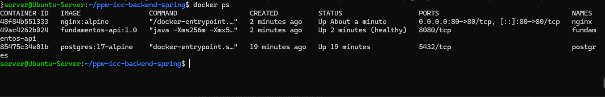

---

## 2. Health check desde Ubuntu Server

Desde Ubuntu Server se comprobó el funcionamiento de la API a través de Nginx mediante:

```bash
curl http://localhost/api/actuator/health
```

La respuesta obtenida fue:

```json
{
  "status": "UP"
}
```

Esto confirma que Nginx puede comunicarse correctamente con el contenedor `fundamentos-api`.

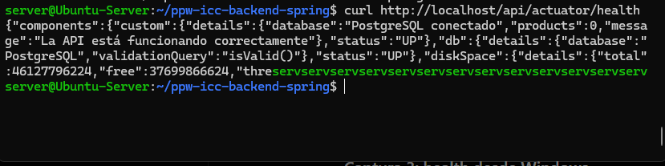

---

## 3. Health check desde la máquina anfitriona

Desde Windows PowerShell se utilizó la IP Host-Only real del Ubuntu Server:

```powershell
curl.exe http://192.168.56.101/api/actuator/health
```

La respuesta obtenida fue:

```json
{
  "status": "UP"
}
```

Esto comprueba el flujo completo:

```text
Windows
  → Ubuntu Server
  → Nginx
  → Spring Boot
```

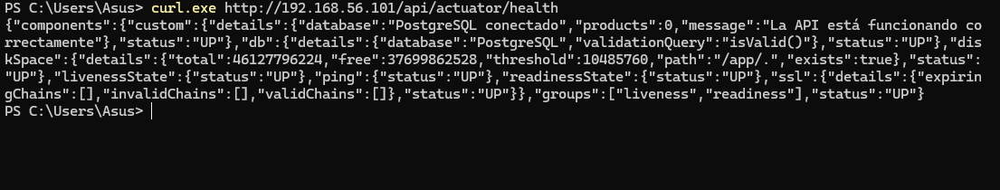

---

## 4. PostgreSQL mediante la alternativa fallback

Inicialmente se consideró utilizar PostgreSQL instalado en la máquina anfitriona.

Debido a los problemas de conexión, puertos y autenticación, se utilizó la alternativa fallback permitida por la práctica: ejecutar PostgreSQL en un contenedor independiente dentro de Ubuntu Server.

El volumen persistente fue creado con:

```bash
docker volume create postgres-data
```

El contenedor PostgreSQL fue creado con:

```bash
docker run -d \
  --name postgres \
  --network app-network \
  -e POSTGRES_DB=devdb \
  -e POSTGRES_USER=ups \
  -e POSTGRES_PASSWORD=ups123 \
  -v postgres-data:/var/lib/postgresql/data \
  postgres:17-alpine
```

La URL utilizada por Spring Boot fue:

```text
jdbc:postgresql://postgres:5432/devdb
```

El nombre `postgres` funciona como hostname gracias al DNS interno de la red Docker `app-network`.

La conexión fue verificada con:

```bash
docker run --rm \
  --network app-network \
  -e PGPASSWORD=ups123 \
  postgres:17-alpine \
  psql \
    -h postgres \
    -p 5432 \
    -U ups \
    -d devdb \
    -c 'SELECT current_database(), current_user;'
```

La respuesta obtenida fue:

```text
 current_database | current_user
------------------+-------------
 devdb            | ups
```

También se verificaron las tablas con:

```bash
docker exec postgres \
  psql -U ups -d devdb \
  -c '\dt'
```

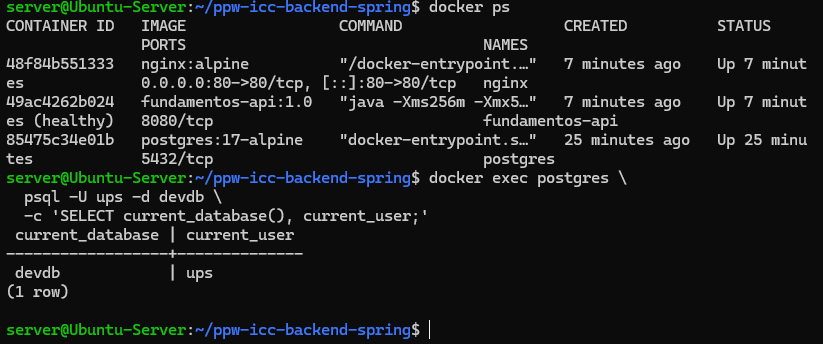

---

## 5. Consumo del login desde Postman

Desde la máquina anfitriona se probó el endpoint de autenticación usando Postman.

Método utilizado:

```text
POST
```

URL:

```text
http://192.168.56.101/api/auth/login
```

Header:

```http
Content-Type: application/json
```

Body enviado:

```json
{
  "email": "usera@ups.edu.ec",
  "password": "Password123"
}
```

La API respondió con:

```text
200 OK
```

La respuesta incluyó:

```json
{
  "token": "ACCESS_TOKEN",
  "refreshToken": "REFRESH_TOKEN",
  "type": "Bearer",
  "userId": 1,
  "email": "usera@ups.edu.ec",
  "roles": [
    "ROLE_USER"
  ]
}
```

Esto demuestra que el flujo externo funciona correctamente:

```text
Postman
  → 192.168.56.101:80
  → Nginx
  → fundamentos-api:8080
  → PostgreSQL
```

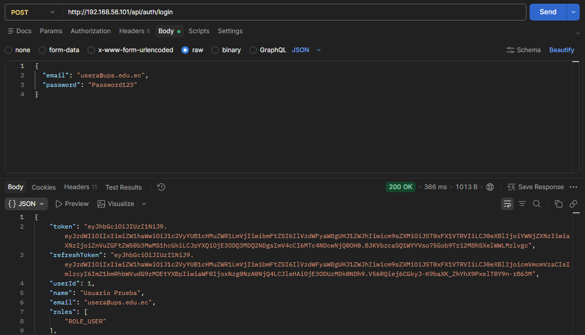

---

# Configuración de Nginx

Nginx fue configurado como proxy inverso mediante el archivo:

```text
nginx/default.conf
```

Configuración utilizada:

```nginx
upstream spring_backend {
    server fundamentos-api:8080;
    keepalive 16;
}

server {
    listen 80;
    server_name _;

    client_max_body_size 10M;

    location = / {
        default_type text/plain;
        return 200 "Nginx activo\n";
    }

    location = /api/actuator/health {
        proxy_pass http://spring_backend;
        access_log off;

        proxy_set_header Host $host;
        proxy_set_header X-Real-IP $remote_addr;
        proxy_set_header X-Forwarded-For $proxy_add_x_forwarded_for;
        proxy_set_header X-Forwarded-Proto $scheme;
    }

    location /api/ {
        proxy_pass http://spring_backend;
        proxy_http_version 1.1;

        proxy_set_header Host $host;
        proxy_set_header X-Real-IP $remote_addr;
        proxy_set_header X-Forwarded-For $proxy_add_x_forwarded_for;
        proxy_set_header X-Forwarded-Proto $scheme;

        proxy_connect_timeout 5s;
        proxy_send_timeout 60s;
        proxy_read_timeout 60s;
    }
}
```

Nginx fue ejecutado mediante:

```bash
docker run -d \
  --name nginx \
  --network app-network \
  -p 80:80 \
  -v "$(pwd)/nginx/default.conf:/etc/nginx/conf.d/default.conf:ro" \
  nginx:alpine
```

La configuración fue validada mediante:

```bash
docker exec nginx nginx -t
```

---

# Ejecución final de Spring Boot

Después de validar temporalmente la API con el puerto `8080`, el contenedor fue recreado sin publicar directamente ese puerto:

```bash
docker rm -f fundamentos-api
```

```bash
docker run -d \
  --name fundamentos-api \
  --network app-network \
  --env-file .env.ubuntu \
  fundamentos-api:1.0
```

De esta forma, Spring Boot solamente puede ser accedido desde otros contenedores pertenecientes a `app-network`.

El único servicio publicado hacia la máquina anfitriona es Nginx.

---

# Resultado final

La configuración final quedó de la siguiente manera:

```text
Nginx
  Imagen: nginx:alpine
  Puerto interno: 80
  Puerto publicado: 80
  Red: app-network

Spring Boot
  Imagen: fundamentos-api:1.0
  Puerto interno: 8080
  Puerto publicado: ninguno
  Red: app-network

PostgreSQL
  Imagen: postgres:17-alpine
  Puerto interno: 5432
  Puerto publicado: ninguno
  Red: app-network
  Volumen: postgres-data
```

La URL pública de la API dentro de la red Host-Only es:

```text
http://192.168.56.101/api
```

El health check se encuentra disponible en:

```text
http://192.168.56.101/api/actuator/health
```

Swagger puede consultarse mediante:

```text
http://192.168.56.101/api/swagger-ui/index.html
```

El login se encuentra disponible en:

```text
http://192.168.56.101/api/auth/login
```